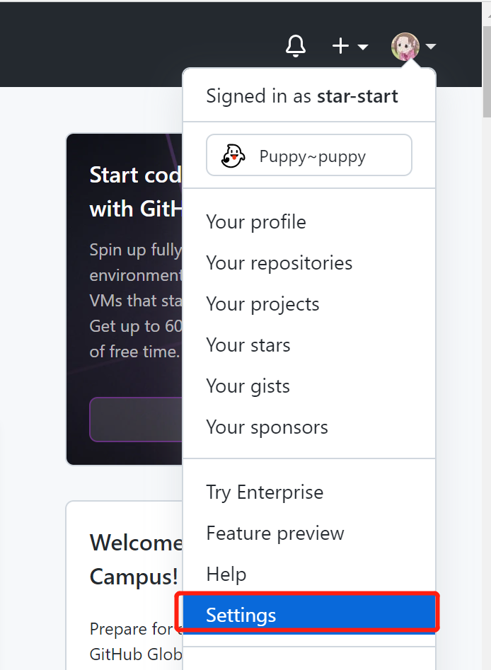

### Git与Github搭建与操作（windows 10 纯小白）

#### 1.下载GitHub，有个账号

#### 2.下载Git

**下载链接**：https://git-scm.com/

直接下载最新版就好了，我下载的就是windows 64 位的。

#### 3.Git操作

##### 3.1 先创建文件夹，当成本地仓库

> - 我的安装好后，直接在桌面右键，点开git bash,在这里进行一系列操作
>
> - 我新建了一个在F盘的MyGit/learningcode
> - 进入该目录，pwd 查看自己当前目录

##### 3.2 初始化 

> 1.`git init`
>
> 2.`ls -la`
>
> 发现.git的隐藏文件，说明已经初始化成功了

##### 3.3 设置签名

> 1.项目级别/仓库级别：仅在当前本地库范围内有效
>
> `git config user.name xxxx
> git config user.email xxxx`
>
> 2.系统用户级别：登录当前操作系统的用户范围
>
> `git config --global user.name xxxx
> git config --global user.email xxxx`
>
> 3.**级别优先级**
>
> **就近原则：项目级别优先于系统用户级别，二者都有时采用项目级别的签名**
>
> **如果只有系统用户级别的签名，就以系统用户级别的签名为准**
>
> **二者都没有不允许**

##### 3.4 查看状态

> `git status`

查看工作区、暂存区状态

##### 3.5 添加到缓存区

> 1.随便放两个文件夹进去目录，你也可以先直接vim随便创建一个文件
>
> 
>
> 2.使用 `git status ` 查看状态
>
> 3.使用 `git add ` 命令添加到缓存区

##### 3.6 Github 远程仓库建立

> 1.写入 SSH keys 的值
>
> SSH and GPG keys ->New SSH key 
>
> 
>
> 
>
> 2,复制安装git时候的公钥（如果没有找到.ssh文件，可以看一下3.7，创建一个，再继续从这里往下走）
>
> 
>
> 按照文件路径找到.ssh文件夹，找到.pub后缀的文件，用记事本打开，把内容全部复制粘贴到刚刚在 github 打开的SSH keys/Add new 的key位置，点击 Add SSH key就好了。
>
> 
>
> 3.Emails不能设置成private，即：Keep my email adress private 把前面的那个给勾掉。
>
> 
>
> 4.创建远程仓库
>
> 
>
> 进去以后，按下那个new
>
> 
>
> 随便取一个名字就好啦
>
> 
>
> 5.本地跟远程仓库的连接
>
> `git add .`
>
> `git common -m "该文件的介绍"`
>
> `git remote add origin 你的GitHub创建的仓库的地址`
>
> 
>
> 6.把本地的仓库master分支push到远程仓库里面
>
> `git push -u origin master `
>
> 7.刷新 GitHub  就看见了刚上传的项目

##### 3.7 生成SSH（如果你没有的话可以用这个生成）

>1.检查[SSH](https://so.csdn.net/so/search?q=SSH&spm=1001.2101.3001.7020) keys是否存在：
>
>`ls -al ~/.ssh`
>
>2.生成新的ssh key
>
>`ssh-keygen -t rsa -C “your_email@example.com” `

##### 3.8 查看历史记录

>1.git log
>
>
>
>2.git log --pretty=oneline
>
>
>
>3.git reflog 
>
>